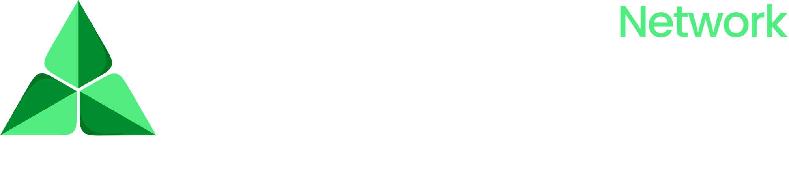

  

# Welcome to Arbridge Network

Arbridge Network is an automated blockchain market execution ecosystem built on a singular conviction: that the greatest opportunities in blockchain markets are not found in speculation — they are found in the structure of the market itself.

The Web3 ecosystem is one of the most dynamic financial systems ever created, yet it still operates with significant inefficiencies. One of the largest of these is **arbitrage** — price discrepancies that constantly occur across exchanges and blockchain ecosystems. In theory, these opportunities represent billions of dollars in potential value. In practice, only a small percentage of market participants can capture them, because doing so requires advanced infrastructure, constant monitoring, and the ability to execute transactions across multiple chains at high speed.

Arbridge Network exists to close that gap.

## How to use these docs

Start with the [Arbridge Mission](introduction/the-arbridge-vision.md), then explore [PULSE](automation-and-tools/pulse-engine.md) — the intelligent system at the center of the ecosystem — and the three operational tiers that bring it to members: [Pulse Foundation, Grid, and Prime](automation-and-tools/pulse-foundation-grid-and-prime.md).

Welcome aboard.
